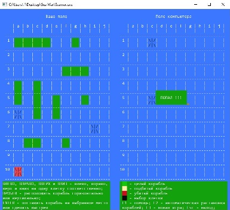

# Learning Project (C++) - Game "Sea War"

Demo:

Tasks & Problems:
1. Creation the game menu - ОК
2. Creation of help - ОК
3. The ability to turn ships - ОК
4. The prohibition of the installation of ships nearby - ОК
5. Random automatic placement of ships (for the computer and the player) - ОК
6. After "Hit" by the computer or player, an extra turn - ОК
7. After "Hit" by the computer but not "Drowning", a shot near the "Hit" - ОК

Compatible with Windows 10.
From Windows 7 and 8.1:
Setup Update KB2999226 - https://www.microsoft.com/en-US/download/details.aspx?id=49077
Microsoft Visual C ++ Redistributable Package - https://www.microsoft.com/en-US/download/details.aspx?id=48145
Microsoft Visual C++ 2015 Update 3 - https://www.microsoft.com/en-US/download/details.aspx?id=53840
 
Demo jpg 
  
 
